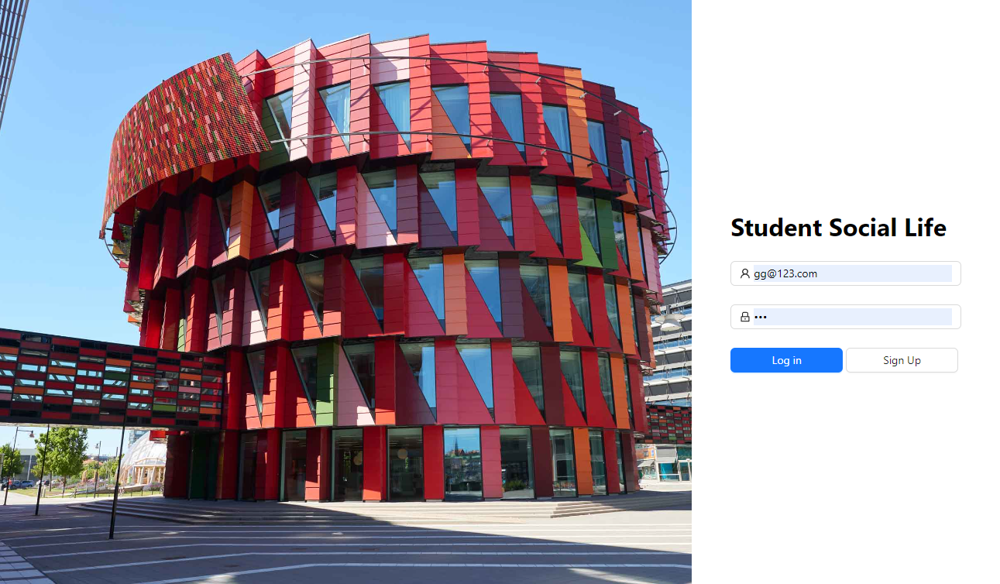

# Student Social Frontend

## Overview
The Student Social Frontend is a dynamic web application designed to offer students a platform for social interaction, content sharing, and community engagement. Built with React and leveraging Ant Design for its user interface components. Axios is used as the HTTP client for efficient communication with the backend services.

## Screenshots


## Features
- **User Interface**: Utilizes Ant Design for a modern, responsive design that enhances user interaction.
- **Authentication**: Supports sign-in/sign-up functionalities, securely integrated with the backend through Axios.
- **Post Interactions**: Allows users to create, share, and comment on posts, fostering a vibrant community dialogue.
- **Real-time Chat**: Enables users to communicate in real-time, enhancing the social experience.

## Prerequisites
- Node.js (LTS version recommended)
- npm or yarn

## Setup and Installation
1. **Clone the repository**
   ```bash
   git clone git@github.com:bymaxchen/student-social-frontend.git
   cd student-social-frontend

2. **Install dependencies**
    ```bash
    npm install
    # or if you use yarn
    yarn install

3. **Run the application**
    ```bash
    npm start
    # or if you use yarn
    yarn start

## Building and Deployment
    npm start
    # or if you use yarn
    yarn start

## License
This project is licensed under the MIT License - see the LICENSE file for details.

## Acknowledgements
+ React for the powerful JavaScript library for building user interfaces.
+ Ant Design for providing a comprehensive set of high-quality React UI components.
+ Axios for making HTTP requests to communicate with the backend services.
## Contact
For any questions or suggestions, feel free to contact chenzy0620@outlook.com.